# 🚗 Car & Pedestrian Detection using YOLOv8

<p align="center">


</p>

---

## 📑 Table of Contents

* [Project Overview](#-project-overview)
* [Objectives](#-objectives)
* [Dataset Description](#-dataset-description)
* [Data Annotation](#-data-annotation)
* [Data Preprocessing and Augmentation](#-data-preprocessing--augmentation)
* [Model Architecture](#-model-architecture)
* [Training Configuration](#-training-configuration)
* [Training Performance](#-training-performance)
* [Model Performance Metrics](#-model-performance-metrics)
* [Confusion Matrix](#-confusion-matrix)
* [Precision–Recall Curve](#-precisionrecall-curve)
* [F1 Score Analysis](#-f1-score-analysis)
* [Detection Results](#-detection-results)
* [Real-World Image Evaluation](#-realworld-image-evaluation)
* [Failure Cases and Limitations](#-failure-cases-and-limitations)
* [Possible Improvements](#-possible-improvements)
* [Conclusion](#-conclusion)
* [Author](#-author)

---

# 📌 Project Overview

This project implements a **deep learning-based object detection system** capable of detecting **cars and pedestrians** in images using the YOLOv8 (You Only Look Once) architecture.

The model was trained on a **custom dataset containing annotated images of cars and pedestrians**. The goal of this project is to develop a robust object detection system and evaluate its performance using standard metrics such as **Precision, Recall, and Mean Average Precision (mAP)**.

Object detection models like YOLO are widely used in:

* Autonomous vehicles
* Smart traffic monitoring
* Surveillance systems
* Pedestrian safety systems
* Intelligent transportation systems

This project demonstrates how deep learning can be applied to detect multiple objects in real-world scenes efficiently.


---

# 🎯 Objectives

The primary objectives of this project are:

* Create a dataset containing **cars and pedestrians**
* Annotate the dataset in **YOLO object detection format**
* Train a **YOLOv8 object detection model**
* Evaluate the trained model using performance metrics
* Analyze **failure cases and model limitations**

---

# 📂 Dataset Description
### Download Dataset

You can download the dataset from Roboflow:

https://app.roboflow.com/ds/NGlYq7rAEL?key=Nq5fglR2MZ

A custom dataset containing images of **cars and pedestrians** was prepared using filtered images from publicly available datasets.

### Dataset Statistics

| Dataset Split           | Images  |
| ----------------------- | ------- |
| Training (70%)          | 656     |
| Validation (20%)        | 183     |
| Testing (10%)           | 92      |
| **Total Source Images** | **931** |

Number of classes:

```
0 → Car
1 → Pedestrian
```

Many images contain **both cars and pedestrians**, allowing the model to learn **multi-class object detection in complex scenes**.

---

# 🏷️ Data Annotation

The dataset was annotated using a **YOLO compatible annotation format**.

Each object instance is represented by:

```
(class_id, x_center, y_center, width, height)
```

Where:

| Parameter | Description         |
| --------- | ------------------- |
| class_id  | Object class label  |
| x_center  | Center X coordinate |
| y_center  | Center Y coordinate |
| width     | Bounding box width  |
| height    | Bounding box height |

All coordinates are **normalized relative to image width and height**.

---

# 🔧 Data Preprocessing & Augmentation

Before training the model, preprocessing steps were applied to standardize the dataset.

### Preprocessing

* Auto-orientation to correct image rotation
* Image resizing to **640 × 640 pixels**

### Data Augmentation

To improve model generalization and prevent overfitting:

* Brightness adjustment (-10% to +10%)
* Gaussian blur (up to 1.2px)
* 3× dataset augmentation

### Dataset Size After Augmentation

| Dataset          | Images   |
| ---------------- | -------- |
| Training         | 1964     |
| Validation       | 183      |
| Testing          | 92       |
| **Total Images** | **2239** |

---

# 🧠 Model Architecture

The model used in this project is **YOLOv8n (Nano version)**.

Reasons for choosing YOLOv8n:

* Lightweight architecture
* Fast inference
* Suitable for real-time detection

### Training Parameters

| Parameter      | Value                   |
| -------------- | ----------------------- |
| Model          | YOLOv8n                 |
| Image Size     | 640 × 640               |
| Epochs         | 100                     |
| Batch Size     | 8                       |
| Early Stopping | Enabled (patience = 10) |

Early stopping was used to prevent **overfitting during training**.

---

# 📊 Training Performance

During training:

* Training loss gradually decreased
* Validation loss stabilized
* Precision and Recall improved steadily
* mAP values increased as training progressed

The graphs stabilized after **25–30 epochs**, indicating that the model learned important features successfully.

### Training Graphs

<p align="center">
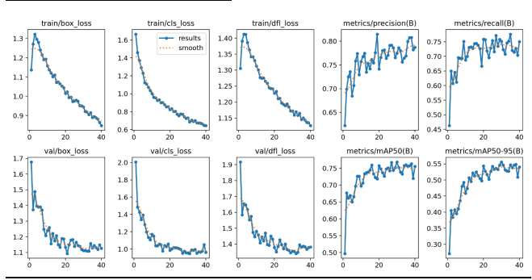
</p>

---

# 📈 Model Performance Metrics

The model was evaluated using standard object detection metrics.

| Metric       | Value     |
| ------------ | --------- |
| Precision    | **0.777** |
| Recall       | **0.751** |
| mAP@0.5      | **0.769** |
| mAP@0.5:0.95 | **0.556** |

These results indicate that the model performs **reliably with balanced precision and recall values**.

---

# 📊 Confusion Matrix

The confusion matrix shows the model’s performance in classifying cars and pedestrians.

<p align="center">
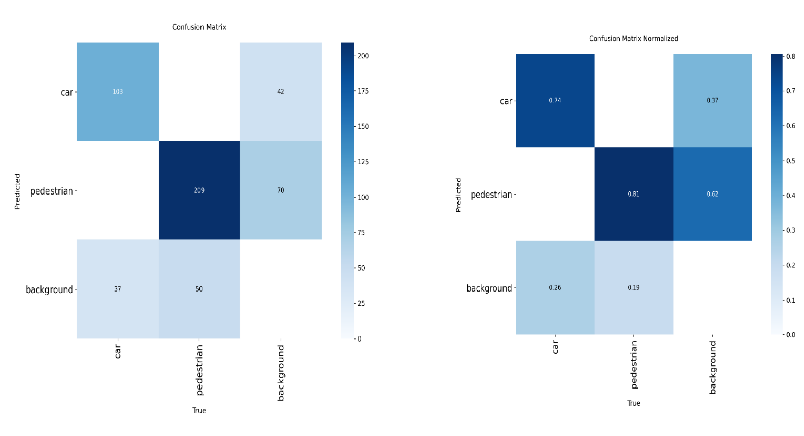
</p>

Observations:

* Most **cars and pedestrians were correctly detected**
* Pedestrian detection performed slightly better
* Some objects were missed due to **small size or occlusion**

---

# 📉 Precision-Recall Curve

<p align="center">
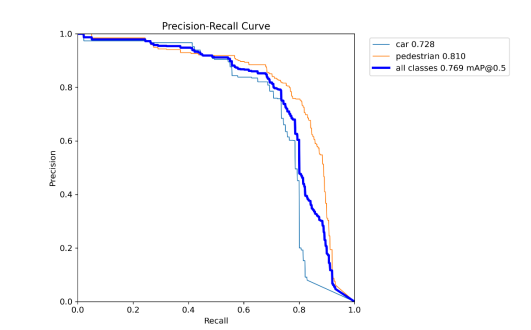
</p>

Key insights:

* Precision = **0.777**
* Recall = **0.751**

The balanced values indicate that the model avoids **too many false positives or missed detections**.

---

# 📊 F1 Score Analysis

The highest F1 score achieved was:

```
F1 Score = 0.76
Confidence Threshold = 0.389
```

<p align="center">
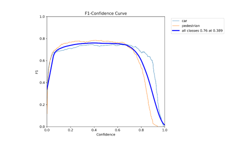
</p>

---

# 🖼 Detection Results

Below are some example detection outputs from the trained model.

<p align="center">
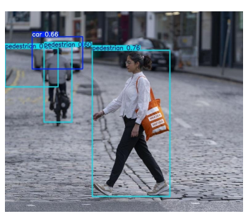
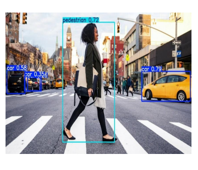
</p>

<p align="center">
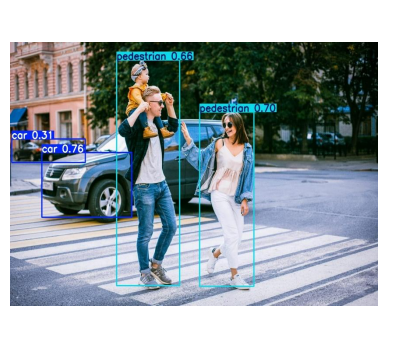
</p>

The model can detect **multiple objects in the same scene** with accurate bounding boxes.

---

# 🌍 Real-World Image Evaluation

The trained model was tested on **unseen real-world images**.

Observations:

* Accurate detection in well-lit scenes
* Ability to detect multiple cars and pedestrians
* Good generalization to new images

<p align="center">
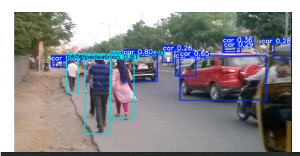
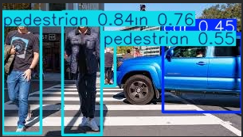
</p>

---

## ⚠️ Failure Cases and Limitations

Although the YOLOv8 model performs well in most situations, some limitations were observed during testing on real-world images.

These failure cases help understand where the model struggles and how it can be improved.

### 1️⃣ False Negatives (Missed Detections)

<p align="center">
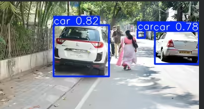
</p>

### 2️⃣ False Positives

<p align="center">
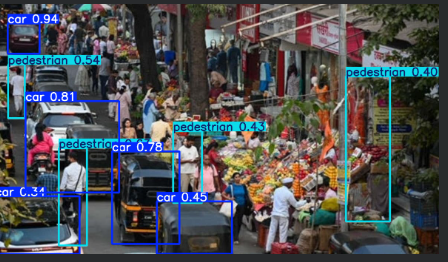
</p>

### 3️⃣ Crowded Scenes / Occlusion

<p align="center">
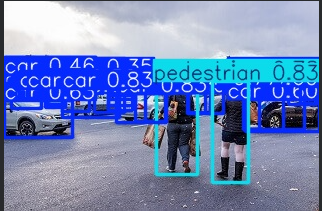
</p>

### 4️⃣ Small Object Detection Issues

<p align="center">
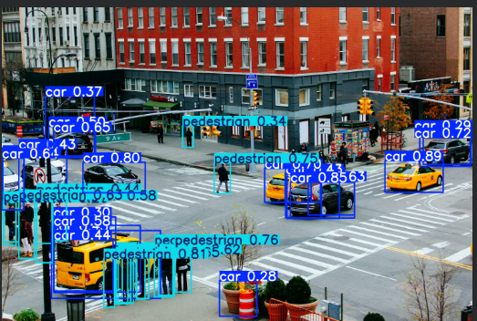
</p>

---

# 🚀 Improvements Attempted

Several techniques were applied to improve performance:

* Data augmentation (brightness + blur)
* Increased dataset size using augmentation
* Image preprocessing and resizing
* Early stopping to prevent overfitting
* Confidence threshold tuning using F1 curve
* Correction of annotation inconsistencies

---

# ✅ Conclusion

In this project, a **YOLOv8-based object detection model** was successfully trained to detect **cars and pedestrians** using a custom annotated dataset.

Key achievements:

* Achieved **mAP@0.5 = 0.769**
* Balanced **precision and recall**
* Stable training and good generalization
* Reliable detection performance in real-world scenarios

Although the model performs well, future improvements could focus on:

* Detecting smaller and occluded objects
* Increasing dataset diversity
* Training larger YOLO models

Overall, this project demonstrates the effectiveness of **YOLO-based object detection systems for real-world applications**.

---

# 👨‍💻 Author

**Sujan KS**

Artificial Intelligence & Machine Learning
Deep Learning & Computer Vision Enthusiast

---
