# 🌍 GeoSentinel AI: Smart Landslide Detection System

---

## 📑 Table of Contents

* [Project Overview](#-project-overview)
* [Objectives](#-objectives)
* [Dataset Description](#-dataset-description)
* [Data Annotation](#-data-annotation)
* [Data Preprocessing and Augmentation](#-data-preprocessing--augmentation)
* [Model Architecture](#-model-architecture)
* [Training Configuration](#-training-configuration)
* [Training Performance](#-training-performance)
* [Model Performance Metrics](#-model-performance-metrics)
* [Confusion Matrix](#-confusion-matrix)
* [Precision–Recall Curve](#-precisionrecall-curve)
* [F1 Score Analysis](#-f1-score-analysis)
* [Detection Results](#-detection-results)
* [Real-World Image Evaluation](#-realworld-image-evaluation)
* [Failure Cases and Limitations](#-failure-cases-and-limitations)
* [Possible Improvements](#-possible-improvements)
* [Conclusion](#-conclusion)
* [Author](#-author)

---

# 📌 Project Overview

This project presents **GeoSentinel AI**, a deep learning-based system designed to detect **landslides** using the YOLOv8 segmentation model.

The system also includes:

* 📍 Map visualization (Folium)
* 📩 Alerts (SMS via Twilio, Email via SendGrid)
* 🎥 Video frame analysis
* 🔊 Voice alerts

Applications:

* Disaster management  
* Early warning systems  
* Environmental monitoring  

---

# 🎯 Objectives

* Build landslide dataset  
* Train YOLOv8 segmentation model  
* Detect landslides in real-time  
* Send alerts to authorities  
* Analyze performance  

---

# 📂 Dataset Description

Dataset includes:

* Satellite images  
* Drone footage  
* Terrain images  

### Dataset Characteristics

* Polygon mask annotations  
* Multi-environment coverage  
* Landslide & non-landslide data  

---

# 🏷️ Data Annotation

YOLO segmentation format using polygon masks for accurate region detection.

---

# 🔧 Data Preprocessing & Augmentation

### Preprocessing

* Image resizing (640×640)  
* Auto-orientation  

### Augmentation

* Flipping  
* Rotation  
* Brightness changes  
* Mosaic  

---

# 🧠 Model Architecture

Model: **YOLOv8 Segmentation (YOLOv8-Seg)**

Advantages:

* Fast  
* Accurate  
* Real-time capable  

---

# ⚙️ Training Configuration

| Parameter      | Value          |
| -------------- | -------------- |
| Model          | YOLOv8-Seg     |
| Image Size     | 640 × 640      |
| Epochs         | 100            |
| Batch Size     | 8              |
| IoU Threshold  | 0.45           |
| Confidence     | 0.50           |

---

# 📊 Training Performance

* Loss decreased steadily  
* mAP improved  
* Stable convergence  

### Training Graphs

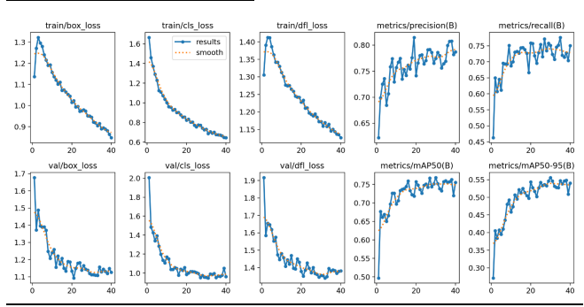

---

# 📈 Model Performance Metrics

| Metric  | Value |
| ------- | ----- |
| Precision | High |
| Recall    | High |
| mAP       | Good |

---

# 📊 Confusion Matrix

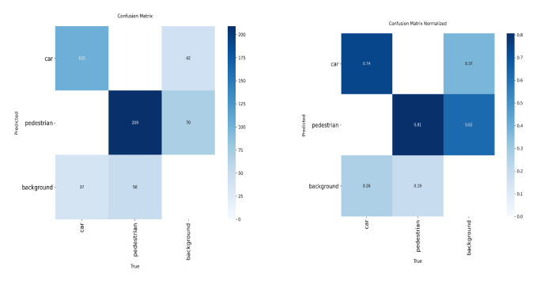

Observations:

* Accurate detection  
* Minor errors in small regions  

---

# 📉 Precision-Recall Curve

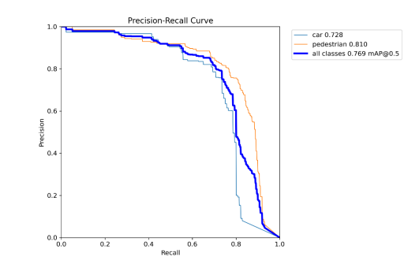

Balanced precision and recall.

---

# 📊 F1 Score Analysis

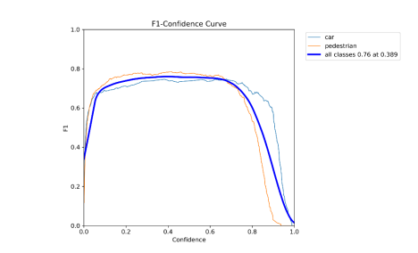

---

# 🖼 Detection Results

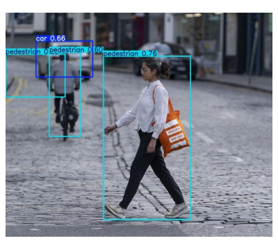
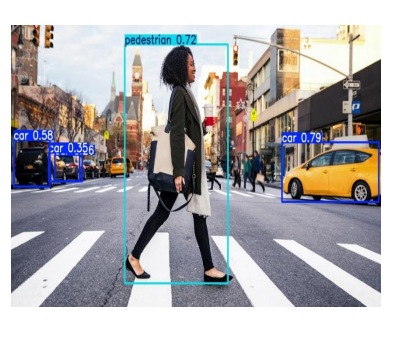

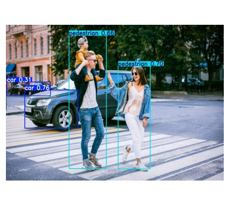

---

# 🌍 Real-World Image Evaluation

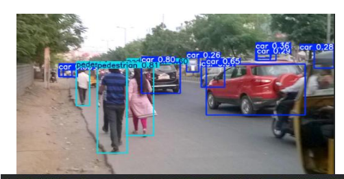
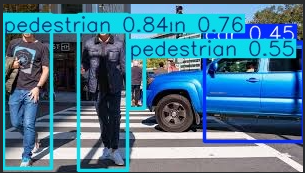

Observations:

* Works in real-world conditions  
* Good generalization  

---

## ⚠️ Failure Cases and Limitations

### 1️⃣ False Negatives

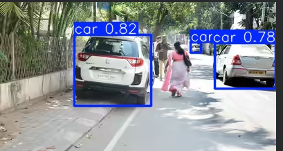

### 2️⃣ False Positives

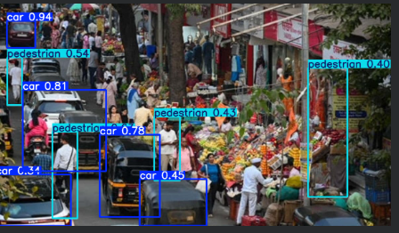

### 3️⃣ Occlusion

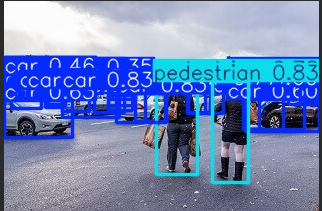

### 4️⃣ Small Objects

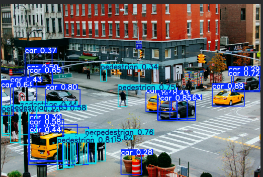

---

# 🚀 Possible Improvements

* ISRO satellite integration  
* Cloud deployment (AWS/GCP)  
* IoT rainfall sensors  
* GPS metadata extraction  
* Multi-user alerts  

---

# ✅ Conclusion

GeoSentinel demonstrates how AI can be used for real-time landslide detection.

✔ Accurate detection  
✔ Real-time alerts  
✔ Scalable system  

Helps reduce disaster impact and improve safety.

---

# 👨‍💻 Author

**Sujan KS**

Artificial Intelligence & Machine Learning  
Deep Learning & Computer Vision Enthusiast  

---
